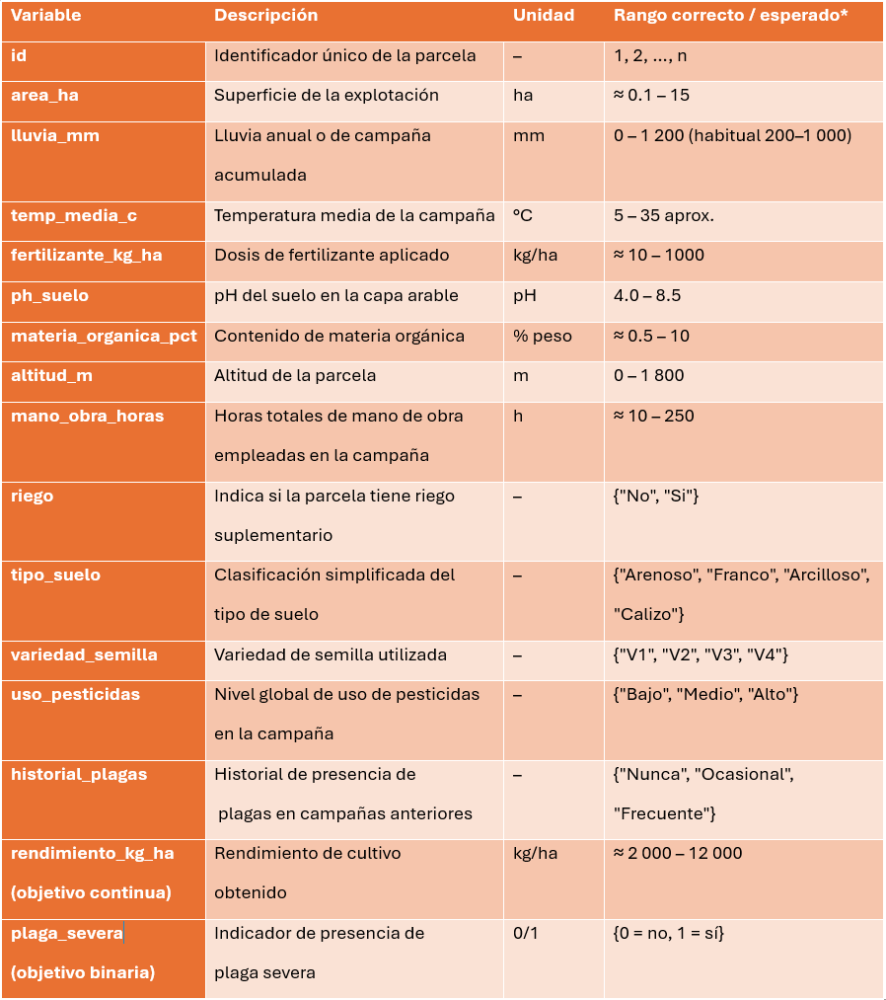
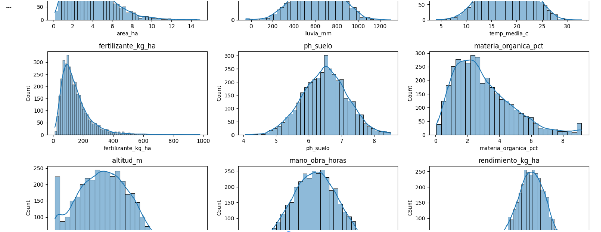
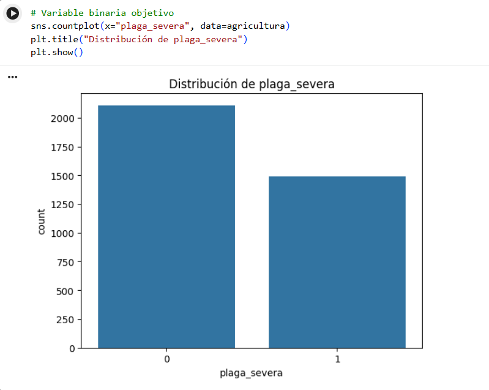
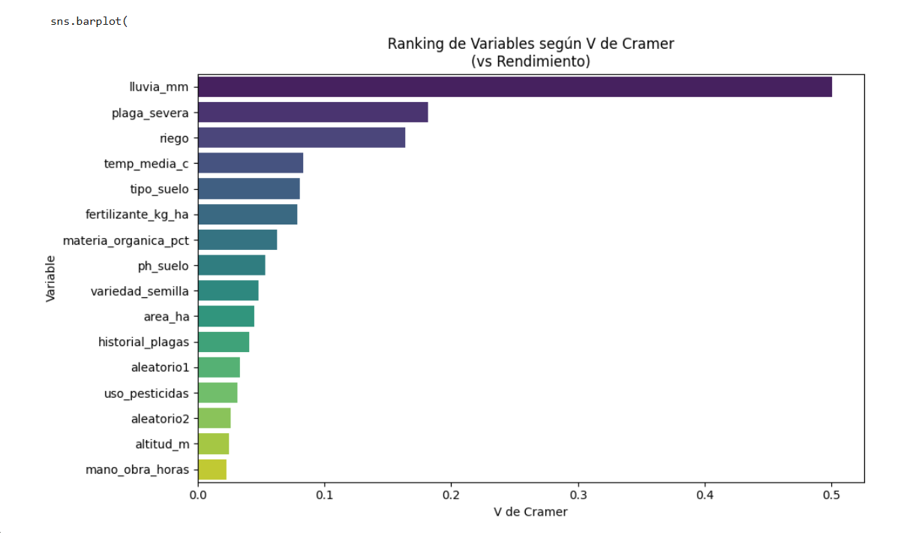
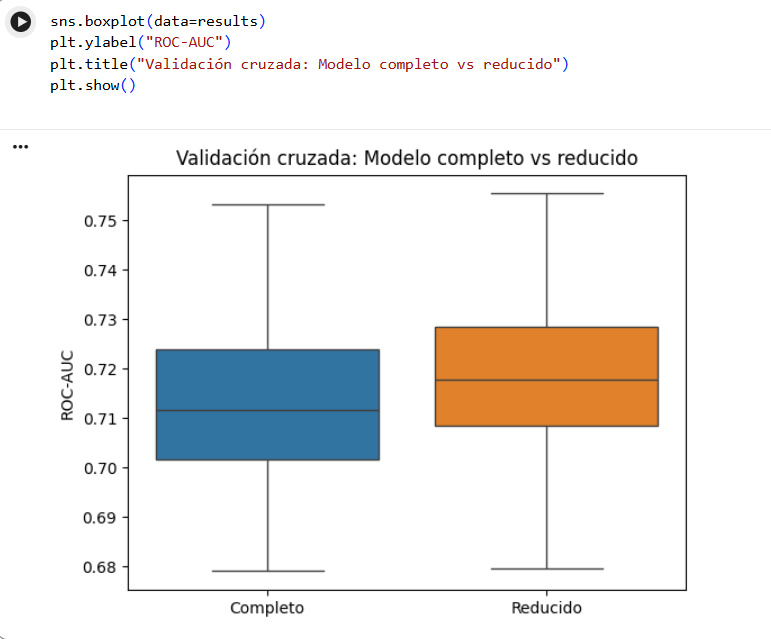

# -Pipeline-de-Modelizacion-Predictiva

# Pipeline de Modelización Predictiva

Este proyecto presenta un flujo completo de modelización predictiva aplicado a un conjunto de datos con variables continuas y categóricas. El objetivo es desarrollar un proceso estructurado de análisis de datos que abarque desde la preparación y limpieza del dataset hasta la construcción e interpretación de modelos estadísticos.

El proyecto forma parte de un ejercicio práctico de análisis avanzado de datos, en el que se exploran diferentes técnicas de modelización y validación con el fin de comprender las relaciones entre las variables y evaluar la capacidad predictiva de distintos modelos.

---

# Objetivo del proyecto

El objetivo principal es desarrollar un pipeline de análisis que permita:

- Preparar y depurar un conjunto de datos realista.
- Identificar relaciones entre variables.
- Construir modelos de regresión para estimar una variable objetivo continua.
- Evaluar el ajuste de los modelos y la relevancia de los predictores.

Este enfoque permite demostrar cómo estructurar un proceso de análisis estadístico reproducible y bien documentado.

---

# Preparación y limpieza de datos

Antes de aplicar cualquier modelo predictivo, se realizó una fase de limpieza y depuración del dataset con el fin de garantizar la calidad de la información.

  
  
Las principales tareas incluyeron:

- Revisión de los tipos de variables.
- Identificación y tratamiento de valores faltantes.
- Detección de valores atípicos.
- Tratamiento de outliers mediante winsorización o imputación.
- Separación de variables predictoras y variables objetivo.

Esta etapa es fundamental, ya que la calidad de los datos influye directamente en la estabilidad y fiabilidad de los modelos estadísticos.

  

  
  
---

# Modelización mediante regresión

Tras la preparación del dataset, se construyeron modelos de regresión con el objetivo de explicar el comportamiento de la variable objetivo continua a partir del conjunto de predictores disponibles.

El proceso incluyó:

- Ajuste de un modelo completo con todos los predictores.
- Evaluación de la significancia estadística de las variables.
- Interpretación de los coeficientes estimados.
- Análisis del ajuste del modelo mediante estadísticas de bondad de ajuste.

Este análisis permite identificar qué variables tienen mayor impacto en la variable objetivo y comprender mejor las relaciones presentes en los datos.
  
  
---

# Resultados

Los modelos estimados permiten identificar patrones relevantes en el comportamiento de la variable objetivo y evaluar la capacidad explicativa de los predictores considerados.

El análisis pone de manifiesto la importancia de una adecuada preparación de los datos y de una interpretación cuidadosa de los resultados estadísticos.

  
  
---

# Tecnologías utilizadas

El proyecto fue desarrollado en Python utilizando las siguientes librerías:

- pandas
- numpy
- scikit-learn
- statsmodels
- matplotlib
- seaborn

Estas herramientas permiten construir pipelines completos de análisis de datos y modelización estadística.

---

---

# Autor

Lorena Carrillo  
Data Analyst | Ciencias Actuariales | Modelización Predictiva
